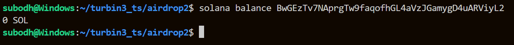

# Turbin3 Rust Prerequisites Assignment

This project contains the Rust implementation of the Turbin3 enrollment prerequisites.


## Setup

### Clone the Repository

```
git clone https://github.com/Subodhkd001/turbin3_prereq.git
cd turbin3_prereq.git/airdrop2
```

### Install Dependencies
Make sure you have Rust and Cargo installed. You can install them using [rustup](https://rustup.rs/).

```
cargo build
```

## Project Structure
airdrop2/
├── src/
│   └── lib.rs             # Main Rust implementation with all tests
├── dev_wallet.json        # Development wallet keypair
├── Cargo.toml            # Rust project configuration
└── Cargo.lock           # Dependency lock file


## Implementations
```bash
# For runing tests
cargo test <name_of_test> -- --show-output
# example
cargo test keygen -- --show-output
```


## Transaction Results 


### Generating a keypair

Generated a new Solana wallet: BwGEzTv7NAprgTw9faqofhGL4aVzJGamygD4uARViyL2

### Claim airdrop for that dev wallet

```
Success! Check your TX here:
https://explorer.solana.com/tx/4NxoXo24hoQjVNZaVVCXXBSWvZZMXxq9p4bh4UUUZMpzcxXm2BdLn8Dztd7fZZzwRVB9U8r5RtYhwHhE714HAvwG?cluster=devnet
```


### Transfer sol from dev-wallet to turbin3 wallet


```
Signature verified
and successfully sent 1 sol to turbin3 wallet
Success! Check out your TX here: https://explorer.solana.com/tx/5eDKzMLUH2WTmCuckhDD7hDSVjfxYmFkrbq5UKyHNjAeBVs3aMs3fcaUrUrV7aShVYPzahMiSUy1Dq2Ux7CgoPG4/?cluster=devnet
```

### Drain the dev-wallet

```
Success! Check out your TX here: https://explorer.solana.com/tx/32D41mVUCuNejEo1KsxL9wksj7AM1A6FNRjGSUfTSVeK8iwNysbwMLPit1yn6XQ288UkkQawXPrnAWiubevTTSVN?cluster=devnet
```


### Interact with the onchain program 
```
Success! Check out your TX here:
https://explorer.solana.com/tx/2XB1Q4t2mBsKcYnc645TZ5WPtoLuacqzF3p4buHYL2976gJo5J2q14RQti9juiqd22FYpy3yjDrzxjsCJg5ZqhPe/?cluster=devnet
```

| Submits Rust prerequisite completion proof and mints completion NFT


